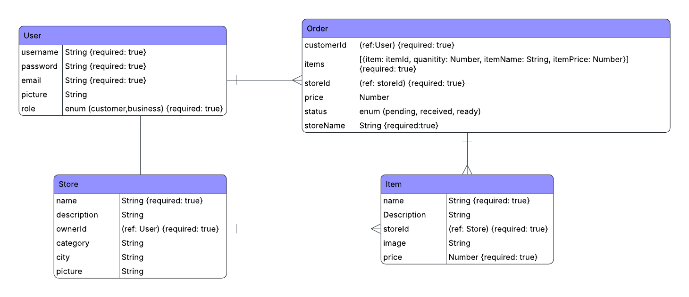

# NearBuy
## Date: 10/30/2025
### By:
* Zahra Salman Alaali
[LinkedIn](http://www.linkedin.com/in/zahra-alaali-) | [GitHub](https://github.com/ZahraAlaali)
* Fatima Mohammed
[LinkedIn](http://www.linkedin.com/in/fatima-m-saleh) | [GitHub](https://github.com/fatima-mohmd)

***

### ***Description***
#### NearBuy is a MERN stack web application that connects users with stores based on city and category.
#### Users can easily browse shops in different cities, explore store details, and view available items. Each shop displays its products with prices and images. Users can add items to their cart and complete purchases directly within the app.

#### On the other side, store owners can register as business users, create their own store, add or update items. This system creates a simple yet efficient bridge between customers and small businesses, helping users shop locally and conveniently.

***

### ***Technologies Used***
* MONGODB
* EXPRESS
* REACT
* Node.js

***

### ***Getting Started***
<!-- #### Sign up and sign in as a new user and then walk through the Ranger creation page to begin your warband. -->
#### A Trello board was used to keep track of development progress and can be viewed [here](https://trello.com/b/Cpm3B7Fu/challenge-race).
#### WireFrame [link](https://www.figma.com/site/MZCPfPEYKCZ3XnnsbNjSEh/Untitled?node-id=0-1&p=f&t=8dBD9ESHzvIDRK9G-0)

<!-- backend link: https://nearbuy-backend-foq6.onrender.com/ -->
#### The project itself was deployed and can be viewed [here](https://nearbuy.surge.sh/).

***

### ***Screenshots***
#### ERD

#### CHD

***

### ***Future Features***
- [ ] Sales Analytics Dashboard
- [ ] Inventory Management
- [ ] Discounts & Coupons
- [ ] Order Tracking Notifications
- [ ] Payment

***

### ***Credits***
#### ERD: [Lucidchart](https://www.lucidchart.com/pages/landing?utm_source=google&utm_medium=cpc&utm_campaign=_chart_en_tier3_mixed_search_brand_exact_&km_CPC_CampaignId=1484560207&km_CPC_AdGroupID=60168114191&km_CPC_Keyword=lucidchart&km_CPC_MatchType=e&km_CPC_ExtensionID=&km_CPC_Network=g&km_CPC_AdPosition=&km_CPC_Creative=354596054350&km_CPC_TargetID=kwd-33511936169&km_CPC_Country=9218669&km_CPC_Device=c&km_CPC_placement=&km_CPC_target=&gad_source=1&gad_campaignid=1484560207&gbraid=0AAAAADLdSjDr_R_dlDmVzkt65tY2oiHAR&gclid=CjwKCAjwpOfHBhAxEiwAm1SwEvKrrCPgTGnl_rHgXoGpeTM4xUH15fRlCa2t4DPrfRR-X9OHni57lBoCiBgQAvD_BwE)
#### Slide Pitch: [Canvas](https://www.canva.com/)
#### WireFrame: [Figma](https://www.figma.com/)
